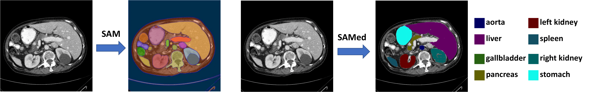
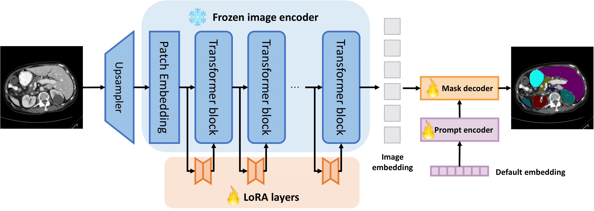

# SAMed
This repository contains the implementation of the following paper:
> **Customized Segment Anything Model for Medical Image Segmentation**<br>
> [Kaidong Zhang](https://hitachinsk.github.io/), and [Dong Liu](https://faculty.ustc.edu.cn/dongeliu/)<br>

 

## Overview
 
We propose SAMed, a general solution for medical image segmentation. Different from the previous methods, SAMed is built upon the large-scale image segmentation model, Segment Anything Model (SAM), to explore the new research paradigm of customizing large-scale models for medical image segmentation. SAMed applies the low-rank-based (LoRA) finetuning strategy to the SAM image encoder and finetunes it together with the prompt encoder and the mask decoder on labeled medical image segmentation datasets. We also observe the warmup finetuning strategy and the AdamW optimizer lead SAMed to successful convergence and lower loss. Different from SAM, SAMed could perform semantic segmentation on medical images. Our trained SAMed model achieves 81.88 DSC and 20.64 HD on the Synapse multi-organ segmentation dataset, which is on par with the state-of-the-art methods. We conduct extensive experiments to validate the effectiveness of our design. Since SAMed only updates a small fraction of the SAM parameters, its deployment cost and storage cost are quite marginal in practical usage.

## Todo list
- [ ] Make a demo.
- [ ] Finetune on more datasets
- [ ] Make SAMed based on `vit_l` or `vit_h` mode of SAM

## Prerequisites

- Linux (We tested our codes on Ubuntu 18.04)
- Anaconda
- Python 3.7.11
- Pytorch 1.9.1

To get started, first please clone the repo
```
git clone https://github.com/hitachinsk/SAMed.git
```
Then, please run the following commands:
```
conda create -n SAMed python=3.7.11
conda activate SAMed
pip install -r requirements.txt
```

## Quick start
